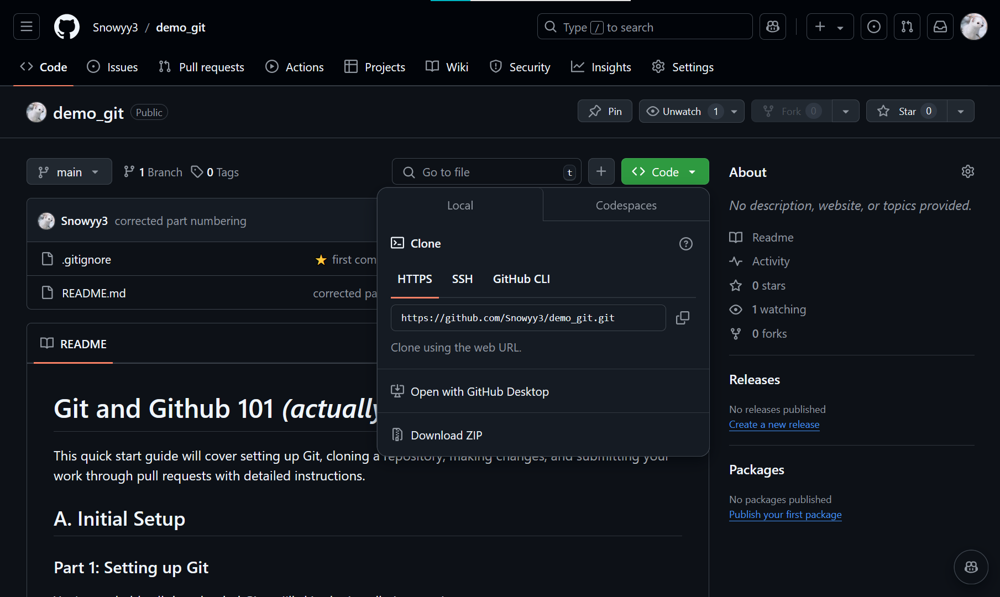

<div align="center">
  
</div>


<br>

# **Git and Github 101** *(actually just enough to colab)*

This quick start guide will cover setting up Git, cloning a repository, making changes, and submitting your work through pull requests with detailed instructions.


## **!! 📝 Notes:**

### **1. Disclaimers**
- Mọi người ơi t chỉ viết sơ qua thôi nhá, cái này cũng không ngắn và không đơn giản lắm nên có gì hỏi AI hoặc xem video/guide bên ngoài nhé
- Nếu có gì mắc vẫn không hiểu thì có thể hỏi t sau nha (dù t cũng không dám chắc vì t vừa tải git về chưa được 1 tuần =)))
- Thông cảm nha, guide hơi sơ sài và thiếu hình ảnh. Đọc với thử xong mà mọi người vẫn muốn có 1 buổi meet chỉ cụ thể trong VS Code thì bảo t nhé

### **📢 2. Thực hành luôn nha**

Mọi người thực hành luôn với repo này nhé (cách lấy link git repo trong ảnh dưới). 🚨 Đọc xong thì làm:
1. Tạo một file `<tên mình>.txt' ở trong repo này
2. Chỉnh sửa file `members.py` để thêm dòng `print("<tên mình>")`
3. Stage all changes (`git add .`), commit, push/open pull request




## **🛠️ A. Initial Setup**

### **Part 1: Setting up Git**

You've probably all downloaded Git so I'll skip the installation part:)

#### 1.  **Open Your Terminal:**
- Assuming you're all using Windows and VS Code, open the integrated terminal.
- Shortcut: press `Ctrl + J`, or ```Ctrl + ` ```

#### 2.  **Configure your identity:**

Git needs to know who you are to track your contributions. Set your name and email using the following commands:

```bash
git config --global user.name "Your Name"
```

```bash
git config --global user.email "your.email@example.com"
```

- Replace `"Your Name"` with your name (e.g., `"Tzuyu"`). Can be a nickname or real name, idk, whatever, it's just to identify who changed what :))
- Replace `"your.email@example.com"` with your actual email address (e.g., `jane.doe@example.com`). Or even better, the email address on Github if you have one (looks something like `<random>+<Github username>@users.noreply.github.com`).

### **Part 2: Cloning the Repository**

#### 1.  **Get the Repository URL:**

I will host the repo on my Github, and I will update the link later but it should look something like this: `https://github.com/username/repository-name.git`. You do not need to create a new repo or do anything else.


#### 2.  **Navigate to Your Project Directory and Clone it:**

In your terminal, use the `cd` command to navigate to the directory where you want to store the project. 

For example, if your Python folder is located at `C:\Users\yourusername\NEU\Python`, and you want to store the project in a new folder called `Project` inside it:

**File Structure Before Cloning:**

```
C:\Users\yourusername\NEU\Python\
├── Project\ (folder)
│   └── (empty)
├── test.py
└── some_file.txt 
```

**Cloning Directly into the Current Folder:** *(remember the dot at the end of git clone)*

```bash
cd C:\Users\yourusername\Documents\Python\Project
git clone https://github.com/username/repository-name.git .
```

**File Structure After Cloning Directly:**

```
C:\Users\yourusername\NEU\Python\
├── Project\
│   ├── (Files and folders from the "repository-name" repository)
├── test.py
└── some_file.txt
```

- This command creates a local copy of the repository on your computer inside the directory you navigated to.

---

## **✏️ B. Editing, Saving, and Syncing changes** (the important part)

### **Part 1: Making Changes**

#### 1.  **Navigate to the Repository:**
Use the `cd` command to enter the newly created repository folder:

```bash
cd repository-name
```

#### 2.  **Create a Branch:**
Before making any changes, create a new branch to isolate your work.

```bash
git checkout -b your-branch-name
```

- This command creates a new branch and switches you to it.
- Replace `your-branch-name` with a descriptive but short name for your branch (e.g. `feature-fire_bullet`, `feature-new_button`, `bugfix-login_issue`).

**What?**

- Branches are like separate versions of the project. They should be small and focused (for example, you'd create a new branch for a new feature or a bug fix, just one thing at a time).
- With each feature or bug fix you completed, you merge the branch back into the main version of the project.
- After confirming that the merged branch works as expected, you delete the branch and create a new one for the next feature or bug fix. Repeat this process.

**Why?**

- Helps keep the main project clean and organized.
- Allows you to work on separate features or bug fixes without affecting the main project, especially if the branch has a bug that makes the project cannot run (affecting others who are also working on the project).

#### 3.  **Make Your Changes:**
- Open the project files in VS Code and make the necessary changes.
- For example, you're working on a snake game
  + You want to implement the scoreboard feature
  + You create a new branch called `feature-scoreboard`
  + You open `snake.py` and wrote the code for the scoreboard, then Ctrl + S to save the file

#### 4.  **Stage Your Changes:**
After making changes (remember to save the files!!), stage them to include them in your next commit. In other words, add all the files you want to save to the main project to the queue (staging).

```bash
git add .
```

- This command stages all the changes you've made.
- To stage specific files, replace `.` with the file names (e.g., `git add snake.py scores.py`). 98% of the time however, you'll just use `git add .` to stage all the files.

#### 5.  **Commit Your Changes:**
Commit your staged changes with a descriptive message.

```bash
git commit -m "Your commit message"
```

- Replace `"Your commit message"` with a clear and concise description of your changes (e.g., `"Added scoreboard feature"`, `"Fixed the login issue"`).

### **Part 2: Syncing with the Remote Repository**

#### 1.  **Fetch Changes from the Remote:**
Fetch any new changes from the remote repository (if the main project has been updated).

```bash
git fetch origin
```

- This command downloads the latest changes from the remote repository named `origin` (which usually refers to the GitHub repository you cloned from) without merging them into your local branch.

#### 2.  **Pull Changes from the Remote (Optional):**
If there are new changes on the remote, merge them into your local branch (download the changes since you last updated - `git pull`).

```bash
git pull origin main
```

- This command merges the changes from the `main` branch of the remote repository into your current local branch.
- `git pull` is a combination of `git fetch` and `git merge` (check if there's any new changes and download the changes).
- If there are conflicts (e.g., two people edited the same line of code), you'll need to resolve them before you can continue.

#### 3.  **Push Your Changes:**
Push your committed changes to the remote repository.

```bash
git push origin your-branch-name
```

- This command uploads your local branch to the remote repository.
- Which means, upload the changes you've made to the main project.

### **Part 3: Opening a Pull Request** (very, very important)

#### 1.  **Go to GitHub:**
Open your web browser and navigate to the GitHub repository you cloned (e.g., `https://github.com/username/repository-name`).

#### 2.  **Navigate to the "Pull requests" Tab:**
Click on the "Pull requests" tab near the top of the repository page.

#### 3.  **Click "New pull request":**
Click the green "New pull request" button on the right side of the page.

#### 4.  **Choose the Branches:**
- In the "base" dropdown, select the branch you want to merge your changes into (`main`).
- In the "compare" dropdown, select your branch (e.g., `feature-scoreboard`).

#### 5.  **Review the Changes:**
GitHub will show you a comparison of your branch with the base branch. Carefully review the changes to ensure they are correct.

#### 6.  **Provide a Title and Description:**
- Give your pull request a clear and concise title that summarizes the changes (e.g., "`Added the scoreboard feature`").
- In the description box, provide more details about your changes, including:
  + What problem does this pull request solve?
  + How did you implement the solution?
  + Are there any special considerations or testing instructions?
  + *Well actually you don't need to write anything too detailed, just briefly state what this branch does, and even better if you tell how you did it.*

#### 7.  **Add Reviewers (Optional):**
If you want specific people to review your pull request, you can add them as reviewers on the right side of the page.
Please add me (Miles) though :))

#### 8.  **Click "Create pull request":**
Once you're satisfied with the title, description, and reviewers, click the green "Create pull request" button.

#### 9.  **Collaboration and Review:**
- The repository owner or other collaborators can now review your changes, provide feedback, and discuss the implementation.
- You can respond to comments and make further changes to your branch if needed.
- Once the review is complete and everyone is happy with the changes, the repository owner can merge your pull request into the main branch.
